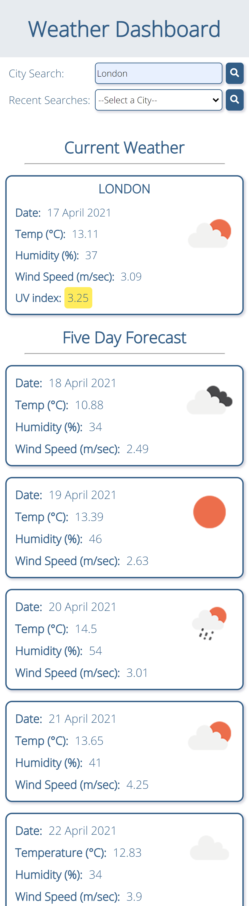

# weather-dashboard

## Project Outline

A simple weather dashboard that utilises the [OpenWeather One Call API](https://openweathermap.org/api/one-call-api) to retrieve the current weather data and a five day forecast for cities. 


## Acceptance Criteria

```md
GIVEN a weather dashboard with form inputs
WHEN I search for a city
THEN I am presented with current and future conditions for that city and that city is added to the search history
WHEN I view current weather conditions for that city
THEN I am presented with the city name, the date, an icon representation of weather conditions, the temperature, the humidity, the wind speed, and the UV index
WHEN I view the UV index
THEN I am presented with a color that indicates whether the conditions are favorable, moderate, or severe
WHEN I view future weather conditions for that city
THEN I am presented with a 5-day forecast that displays the date, an icon representation of weather conditions, the temperature, the wind speed, and the humidity
WHEN I click on a city in the search history
THEN I am again presented with current and future conditions for that city
```

## Design Notes

* Retreives data from OpenWeather via the [OpenWeather One Call API](https://openweathermap.org/api/one-call-api)
* Runs in browser
* Features dynamically updated HTML and CSS
* Saves user's recent searches to local storage

## Link to Deployed Application

https://stephje.github.io/weather-dashboard/

## Screenshots of Deployed Application

### Desktop View


### Mobile View
